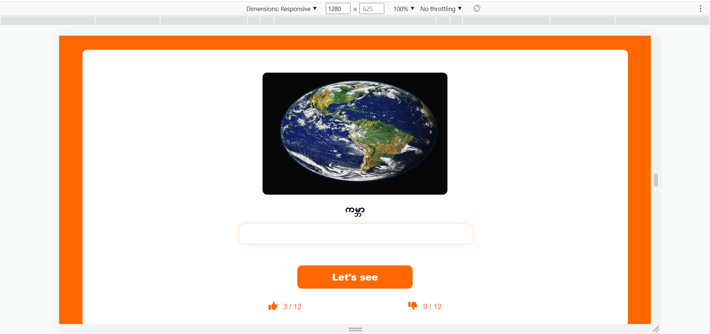
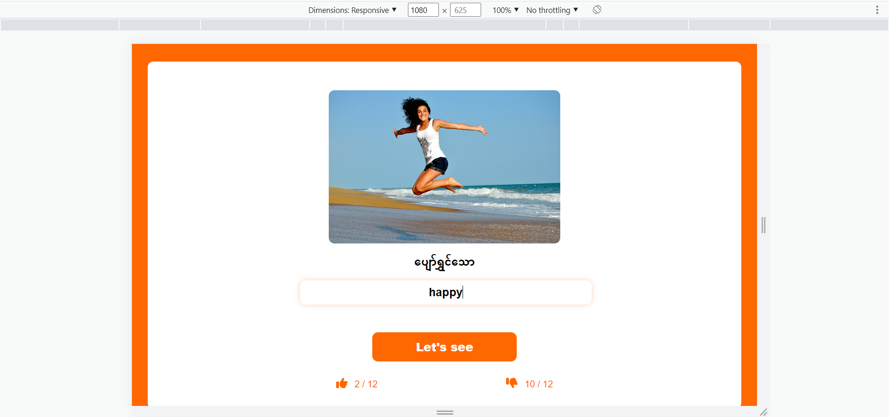
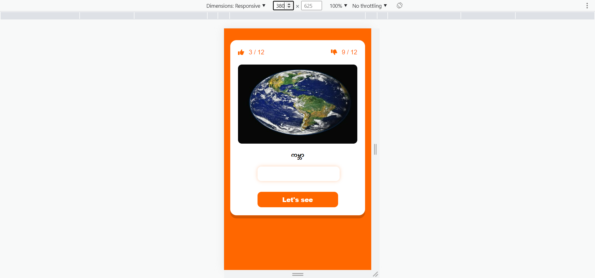

## Name
Responsive Language Learning App with Laravel 8 and Vue 3 Composition API and TypeScript

## Setup Guide for Laravel without docker
```
git clone https://github.com/myopaingthu/language-learning-app-with-lara-vue.git
cd into cloned project folder
cd src
run composer install
copy of .env.example and rename it to .env
change DB section with your local MySQL database setting
create new database in your local MySQL
run php artisan migrate:fresh --seed
run php artisan key:generate
run php artisan serve
```

## Setup Guide for Laravel with docker
```
cd into cloned project folder
run docker-compose build
run docker-compose up -d
run docker exec -it php_laravel sh
run composer install
copy of .env.example and rename it to .env
change DB like this
DB_CONNECTION=mysql
DB_HOST=mysql
DB_PORT=3306
DB_DATABASE=laravel
DB_USERNAME=MYSQL_ROOT_PASSWORD
DB_PASSWORD=root
run php artisan migrate:fresh --seed
run php artisan key:generate
```

## Setup Guide for Vue
```
cd into cloned project folder
cd interview-task-front
run npm install
run with npm run dev or npm run dev -- --port 9000 if you want to specify a port
```

## PC view


## Ipad view


## Mobile view


## Versions
- PHP => ^7.3|^8.0
- Laravel framework => ^8.75
- MySQL => 8.0
- node => 19.0.0
- Vue => ^3.2.41
